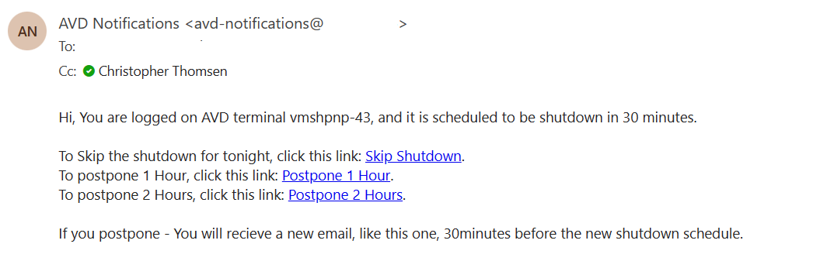

# AVD-ShutdownWebhook

This script is used to send an email to all logged on users in a Azure Virtual Desktop (AVD) environment, when a sessionHost is scheduled to be shutdown.
It is setup as a webhook in a Function App.

The script retrieves an access token for the Graph and Management API, fetches all hostpools within a specified subscription, 
and sends an email notification if any issues are detected.

## Prerequisites

- Azure Virtual Desktop environment
- Azure Function App
- Azure AD App Registration or use the Managed Identity of the Function App.
- A user account to send emails with (I.e. "Notifications@fortytwo.io")

## Permissions required

RBAC / IAM:

- Reader on the Resource Group containing the AVD environment (we recommend using the Mananged Identity of the Function App)

API Permissions:

- Microsoft Graph
  - User.Read
  - Mail.Send (**[Implement RBAC for this permission!!](https://learn.microsoft.com/en-us/Exchange/permissions-exo/application-rbac)**)

## Configuration

Change the following variables in the script to match your environment.

``` PowerShell
# The tenant where the AVD environment is located
$TenantId = "1284b95a-0570-4bf7-be1d-8d8ccca6e9cf"

# The client ID and secret of the App registration used to authenticate - set blank if using Managed Identity
$ClientId = ""
$ClientSecret = ""
# UPN of the sender user - the Appreg or Managed Identity must have the right to send email on behalf of this user
$mailsender = "AVDNotifications@fortytwo.io"
# Array of subscription IDs where we will look for hostpools
$subscriptionid = @("1284b95a-0570-4bf7-be1d-8d8ccca6e9cg", "1284b95a-0570-4bf7-be1d-8d8ccca6e9ch") 

# use the Managed Identity of the functionApp to query the API's and send email?
# If set to false, use the App registration credentials above to authenticate
# PS! The Managed Identity or App Registration must have the correct permissions.
$useManagedIdentity = $true

```

### Sample email to the user



### Sample data from the webhook

``` JSON
{
    "skipUrl":"https://prod.skipdelay.vsdth.visualstudio.com/skip?vmName=vm-t-pn-avdsh&guid=8fdb99d6-ed59-4bef-ab6e-d34ed3b7e574&subscriptionId=3ba20510-asdf-asdf-asdf-1387bd4f7c8c&operation=skip",
    "delayUrl60":"https://prod.skipdelay.vsdth.visualstudio.com/delay?vmName=vm-t-pn-avdsh&guid=8fdb99d6-ed59-4bef-ab6e-d34ed3b7e574&subscriptionId=3ba20510-asdf-asdf-asdf-1387bd4f7c8c&timeDelay=60&operation=delay",
    "delayUrl120":"https://prod.skipdelay.vsdth.visualstudio.com/delay?vmName=vm-t-pn-avdsh&guid=8fdb99d6-ed59-4bef-ab6e-d34ed3b7e574&subscriptionId=3ba20510-asdf-asdf-asdf-1387bd4f7c8c&timeDelay=120&operation=delay",
    "vmName":"vm-t-avdsh",
    "guid":"8fdb99d6-ed59-4bef-ab6e-d34ed3b7e574",
    "owner":null,
    "vmUrl":"https://portal.azure.com/#resource/subscriptions/3ba20510-asdf-asdf-asdf-1387bd4f7c8c/resourceGroups/rg-t-avd/providers/Microsoft.Compute/virtualMachines/vm-t-avdsh",
    "minutesUntilShutdown":"30",
    "eventType":"AutoShutdown",
    "text":"Azure DevTest Labs notification: The resource vm-t-pn-avdsh in resource group rg-t-avd with subscription Id 3ba20510-asdf-asdf-asdf-1387bd4f7c8c is scheduled for automatic shutdown in 30 minutes. this auto-shutdown. . .",
    "subscriptionId":"3ba20510-asdf-asdf-asdf-1387bd4f7c8c",
    "resourceGroupName":"rg-t-avd",
    "labName":null
}
```
